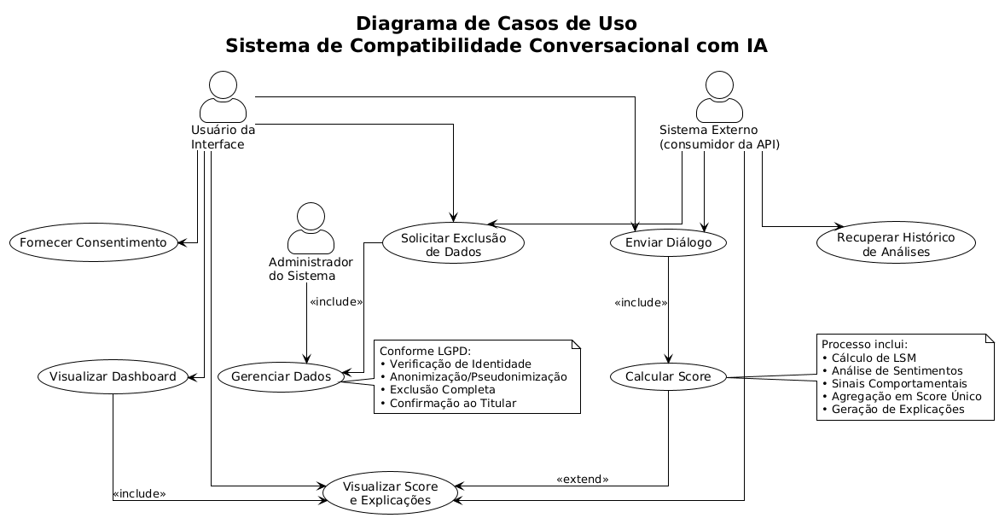
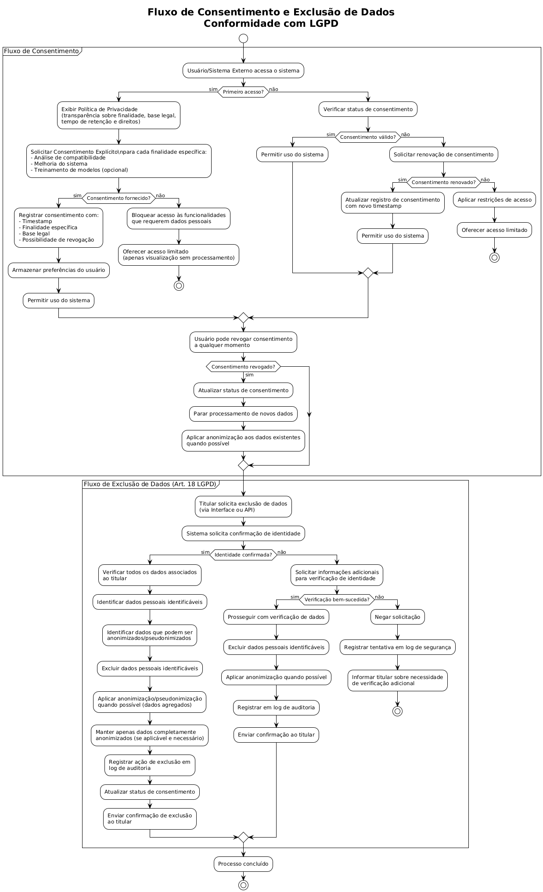
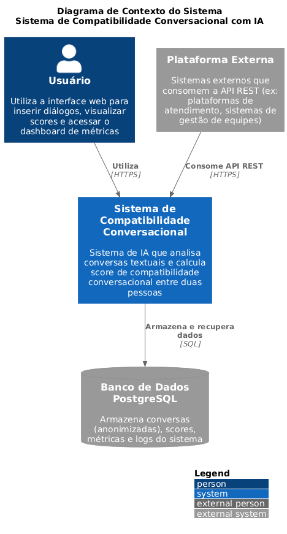
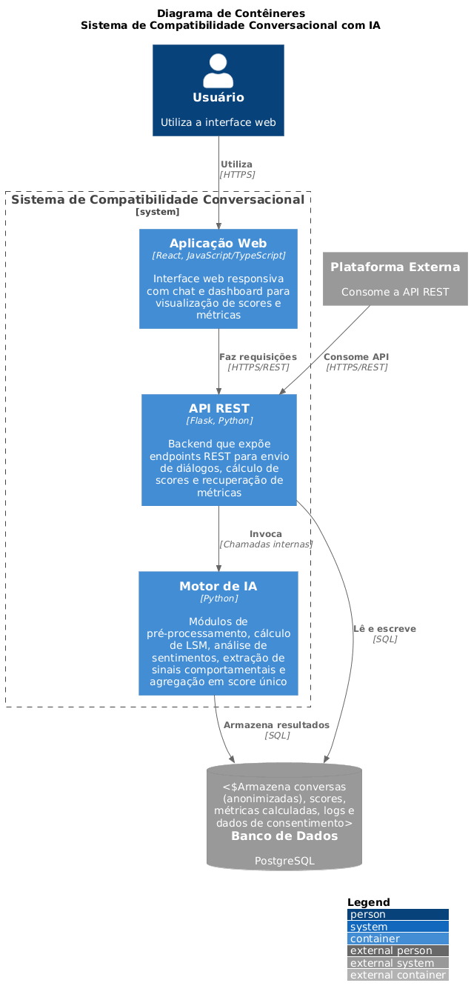
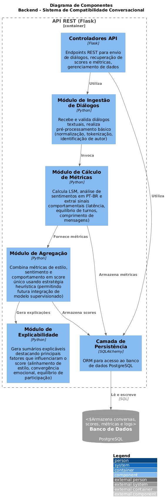
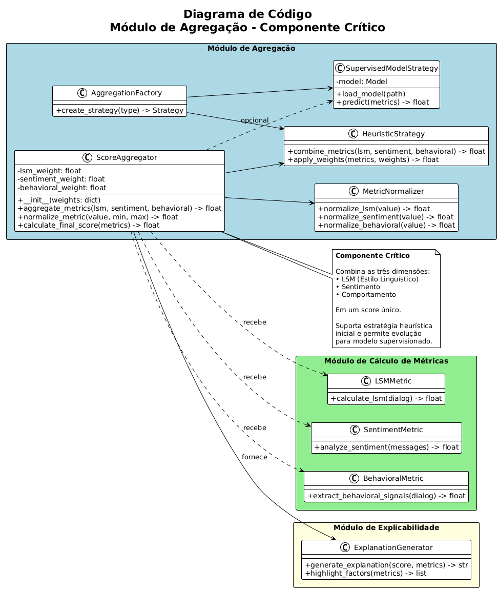

## Capa

- **Título do Projeto**: Compatibilidade Conversacional com IA
- **Nome do Estudante**: Gabriel de Oliveira
- **Curso**: Engenharia de Software
- **Data de Entrega**: 02/12/2025

## Resumo

Este projeto propõe o desenvolvimento de um sistema de Inteligência Artificial para estimar um **índice de compatibilidade conversacional** entre duas pessoas a partir de suas interações textuais. A solução visa aprimorar a colaboração, o engajamento e a satisfação em cenários como atendimento ao cliente, equipes de projeto, duplas de estudo e relacionamentos pessoais, partindo da premissa de que a harmonia comunicativa pode ser inferida diretamente do diálogo. O sistema analisa conversas e gera uma pontuação unificada que reflete a sintonia entre os participantes, combinando três dimensões principais: similaridade de estilo linguístico (Language Style Matching — LSM), convergência de sentimentos e sinais comportamentais (como latência de resposta e equilíbrio de turnos), que são consolidadas por uma camada de agregação em um score final. A solução será disponibilizada via API REST, com armazenamento em banco de dados relacional e um protótipo contendo interface de chat e dashboard para visualização dos resultados e dos fatores que influenciaram a pontuação, garantindo transparência e aderência à LGPD.

## 1. Introdução

- **Contexto**
  Em diversos contextos digitais, como plataformas de atendimento, redes sociais, ambientes de trabalho remoto e aplicativos de relacionamento, a comunicação textual é o principal meio de interação entre pessoas. Apesar de existirem soluções para análise de sentimentos ou de engajamento, ainda é pouco explorada a noção de **compatibilidade conversacional** — isto é, o grau de sintonia entre participantes de um diálogo em termos de estilo linguístico, emoção e dinâmica de interação. A possibilidade de mensurar essa compatibilidade a partir das próprias mensagens abre oportunidades para melhorar o pareamento de pessoas, reduzir atritos de comunicação e apoiar decisões em contextos onde o relacionamento interpessoal é central.

- **Justificativa**
  Tradicionalmente, muitos sistemas de pareamento (por exemplo, entre clientes e atendentes, mentores e mentorados, ou membros de equipes) baseiam-se em perfis estáticos, questionários extensos ou dados demográficos. Essas abordagens podem ser invasivas, pouco dinâmicas e não capturar a realidade da interação cotidiana. Ao contrário, o uso de diálogos reais como fonte de dados permite medir de forma mais direta a qualidade da comunicação, respeitando princípios de consentimento e privacidade. Além disso, ao oferecer explicabilidade sobre como o score é formado (por exemplo, destacando alinhamento de estilo, convergência de sentimentos e reciprocidade), o sistema aumenta a transparência e a confiança dos usuários, contribuindo para boas práticas de IA responsável.

- **Objetivos**
  - **Objetivo Geral**: Desenvolver um sistema de IA capaz de analisar conversas textuais entre duas pessoas e estimar um **score de compatibilidade conversacional**, refletindo sintonia de estilo, alinhamento emocional e dinâmica de interação.
  - **Objetivos Específicos**:
    - Implementar um módulo de **similaridade de estilo linguístico (LSM)** em português, baseado na comparação do uso de palavras-função entre os participantes.
    - Integrar um componente de **análise de sentimentos em PT-BR**, estimando polaridade e intensidade por mensagem e avaliando a convergência emocional ao longo do diálogo.
    - Extrair e consolidar **sinais comportamentais**, como tempo médio de resposta, equilíbrio de turnos de fala e comprimento médio das mensagens.
    - Definir e testar estratégias de **agregação de métricas em um único score** através de abordagem heurística, combinando LSM, análise de sentimentos e sinais comportamentais.
    - Disponibilizar uma **API REST** para consumo do serviço e um **protótipo de interface** (chat e dashboard) para visualização dos scores e de explicações associadas.
    - Garantir **conformidade com a LGPD**, incluindo mecanismos de consentimento, anonimização, minimização de dados e direito de exclusão.

## 2. Descrição do Projeto

- **Linha de Projeto**
  Projetos com IA.

- **Tema do Projeto**
  Desenvolvimento de um sistema de Inteligência Artificial para estimar um **índice de compatibilidade conversacional** entre duas pessoas com base em conversas textuais, integrando análise de estilo linguístico, sentimentos e sinais comportamentais em um score único e explicável.

- **Propósito e Uso Prático**
  O projeto busca resolver o problema de pareamento ineficiente e de conflitos de comunicação em contextos que dependem fortemente de interação textual. Na prática, o sistema será utilizado através de uma **interface web** que permite aos usuários:
  - **Inserir e visualizar conversas**: através de uma interface de chat, os usuários poderão inserir diálogos textuais entre duas pessoas, visualizando as mensagens organizadas por participante e timestamp;
  - **Obter análise de compatibilidade**: após o envio de um diálogo, o sistema processa as mensagens e retorna um score de compatibilidade conversacional, acompanhado de explicações sobre os principais fatores que influenciaram a pontuação (alinhamento de estilo linguístico, convergência emocional, equilíbrio de participação);
  - **Visualizar métricas e insights**: através de um dashboard, os usuários poderão visualizar distribuições de scores, comparar diferentes pares de participantes, identificar padrões de compatibilidade e acessar análises detalhadas sobre as métricas calculadas;
  - **Integrar via API**: sistemas externos poderão consumir o serviço através de uma API REST, permitindo integração com plataformas de atendimento, sistemas de gestão de equipes ou outras aplicações que necessitem de análise de compatibilidade conversacional.
  
  O sistema resolve o problema ao fornecer uma avaliação objetiva e explicável da compatibilidade comunicativa, permitindo que gestores, líderes e usuários tomem decisões informadas sobre pareamento, formação de equipes e estratégias de comunicação.

- **Público-Alvo**
  O sistema é direcionado aos seguintes perfis de usuários e organizações:
  - **Gestores de equipes e líderes de projetos**: profissionais responsáveis por formar e gerenciar equipes que enfrentam desafios de comunicação e colaboração. Buscam ferramentas objetivas para otimizar a composição de squads, duplas de programação, visando reduzir conflitos e aumentar a produtividade através de melhor sinergia comunicativa;
  - **Plataformas de atendimento ao cliente e contact centers**: empresas e organizações que operam serviços de suporte ao cliente e precisam melhorar a qualidade das interações, reduzir tempo de resolução de problemas e aumentar a satisfação dos clientes através de alocação inteligente de atendentes baseada em compatibilidade conversacional;
  - **Plataformas de relacionamento e mentoria**: empresas que operam aplicativos de relacionamento pessoal ou profissional, plataformas de mentoria, coaching ou networking que utilizam comunicação textual como meio principal de interação e necessitam de ferramentas para melhorar o pareamento entre usuários;
  - **Pesquisadores e analistas de comunicação**: acadêmicos e pesquisadores em áreas como Linguística Computacional, Psicologia Social, Ciência da Computação e Comunicação que necessitam de ferramentas para análise quantitativa de padrões conversacionais, validação de teorias sobre compatibilidade comunicativa e desenvolvimento de estudos empíricos sobre interação humana mediada por texto.

- **Problemas a Resolver**
  - Dificuldade em medir, de forma objetiva, a **compatibilidade comunicativa** entre duas pessoas a partir de suas interações reais;
  - Pareamento baseado apenas em perfis estáticos, sem considerar o comportamento conversacional dinâmico;
  - Ausência de ferramentas que consolidem múltiplos sinais (estilo, sentimento, comportamento) em um **score unificado e explicável**;
  - Pouca transparência em sistemas de IA que avaliam interações humanas, o que dificulta a confiança dos usuários;

- **Diferenciação/Ineditismo**
  - Foco na **compatibilidade conversacional** e não apenas na análise de sentimentos ou conteúdo;
  - Uso de **Language Style Matching (LSM)** adaptado para português, algo ainda pouco explorado em soluções práticas;
  - Combinação de **três dimensões complementares** — estilo, sentimento e comportamento — em um **score único**, com explicações textuais para o usuário;
  - Arquitetura pensada para **API-first**, facilitando integração com outros sistemas e plataformas;

- **Limitações**
  - O sistema será focado em **conversas textuais em português (PT-BR)**, não cobrindo áudio, vídeo, imagens, figurinhas ou outros idiomas na versão inicial;
  - Não se propõe a avaliar **conteúdo temático** profundo (por exemplo, veracidade ou qualidade argumentativa), apenas padrões de estilo, sentimentos e dinâmica;
  - A qualidade do score dependerá da **quantidade e qualidade dos dados** disponíveis (número de mensagens, regularidade da conversa, ruídos de linguagem);
  - A versão inicial terá um **protótipo funcional**, não necessariamente otimizado para alta escala ou uso comercial imediato;
  - A utilização de modelos supervisionados estará condicionada à disponibilidade de **conjunto de conversas rotuladas**, podendo, inicialmente, ficar restrita a uma abordagem heurística.

- **Normas e Legislações Aplicáveis**
  - **LGPD – Lei Geral de Proteção de Dados (Lei nº 13.709/2018)**: coleta apenas dos dados necessários, uso com consentimento, anonimização dos textos sempre que possível, mecanismos de exclusão de dados e transparência sobre finalidade do tratamento;
  - **Normas e boas práticas de segurança da informação** (como ISO/IEC 27001 como referência conceitual);
  - **Diretrizes éticas em IA** (UNESCO, OECD AI Principles): foco em transparência, mitigação de vieses, não discriminação e respeito à privacidade;
  - **Boas práticas de acessibilidade digital** (por exemplo, WCAG) para o protótipo de interface, visando facilitar o uso por diferentes perfis de usuários.

- **Métricas de Sucesso**
  - **Qualidade do Score de Compatibilidade**:
    - **Concordância com Avaliação Humana**: em um conjunto de diálogos de teste, avaliadores humanos atribuirão uma classificação de compatibilidade (baixa, média, alta) a cada par de participantes. Será medida a taxa de concordância entre a classificação resultante do sistema (derivada do score numérico) e a classificação atribuída pelos avaliadores humanos;
    - **Coerência Relativa entre Diálogos**: verificar se diálogos intuitivamente percebidos como "mais harmoniosos" tendem a receber scores mais altos do que diálogos com baixa sintonia ou presença de atritos. Critério qualitativo: relatos dos avaliadores indicando se a ordenação dos diálogos gerada pelo sistema "faz sentido" em comparação com a percepção humana;
    - **Comportamento das Métricas Parciais**: analisar se os índices de LSM apresentam valores mais elevados em diálogos harmoniosos; verificar se a convergência de sentimentos aparece de forma coerente em diálogos mais compatíveis; observar se sinais comportamentais (equilíbrio de turnos, latência) se comportam conforme o esperado;

  - **Desempenho Técnico do Sistema (API e Protótipo)**:
    - **Tempo de Resposta da API**: medir o tempo médio de resposta para diálogos de tamanho médio. Critério: ≤ 3 segundos para garantir uso interativo satisfatório;
    - **Confiabilidade Básica**: monitorar se o serviço de API permanece estável durante os testes (ausência de erros críticos em chamadas simples);
    - **Uso de Recursos**: observar consumo de CPU e memória durante o processamento, como referência inicial para futuras otimizações;

  - **Métricas de Uso e Adoção do Protótipo**:
    - **Número de Diálogos Analisados**: quantidade total de diálogos processados durante o período de testes;
    - **Número de Usuários/Contextos Atendidos**: quantidade de usuários distintos que utilizaram o protótipo ou cenários de uso explorados;
    - **Frequência de Uso**: número médio de análises realizadas por usuário ou por sessão de teste;

  - **Usabilidade, Percepção de Valor e Conformidade Ética/Legal**:
    - **Satisfação com o Protótipo**: coletar avaliações subjetivas (escala 1-5) sobre utilidade percebida do score, clareza das explicações e facilidade de uso da interface;
    - **Percepção de Justiça e Transparência**: registrar feedbacks sobre situações em que o score possa parecer injusto ou enviesado, usando esses relatos como insumo para ajustes futuros;
    - **Aspectos de Privacidade e LGPD**: verificar se os usuários compreendem as informações sobre uso de dados e se conseguem solicitar a remoção de dados conforme previsto. A ausência de incidentes de privacidade e o correto funcionamento do fluxo de exclusão de dados também compõem as métricas de sucesso.

**Nota sobre evolução futura**: A eventual adoção de um modelo supervisionado treinado com conversas rotuladas é considerada como possibilidade de evolução futura do trabalho, caso haja disponibilidade de dados anotados em quantidade suficiente.

## 3. Especificação Técnica

  Esta seção apresenta a especificação técnica detalhada do sistema de compatibilidade conversacional, contemplando requisitos funcionais e não funcionais, arquitetura em camadas, stack tecnológica, considerações de segurança e conformidade com a LGPD, além da aderência aos critérios obrigatórios da linha de projeto "Projetos com IA".

### 3.1. Requisitos de Software

- **Requisitos Funcionais (RF)**
  - **RF01**: O sistema deve receber, via API REST, diálogos textuais estruturados contendo mensagens, autor e timestamps.
  - **RF02**: O sistema deve pré-processar os textos (normalização, tokenização, identificação de autor) considerando especificidades do português.
  - **RF03**: O sistema deve calcular um **índice de similaridade de estilo linguístico (LSM)** entre os participantes de cada diálogo.
  - **RF04**: O sistema deve realizar **análise de sentimentos em PT-BR** para cada mensagem, agregando a informação em métricas por participante e por diálogo.
  - **RF05**: O sistema deve extrair **sinais comportamentais**, como tempo médio de resposta, equilíbrio de turnos de fala e comprimento médio das mensagens.
  - **RF06**: O sistema deve combinar as métricas de estilo, sentimento e comportamento em um **score unificado de compatibilidade conversacional**.
  - **RF07**: O sistema deve fornecer, juntamente com o score, um **sumário explicável** destacando os principais fatores que influenciaram o resultado (por exemplo, alto alinhamento de estilo, convergência emocional positiva, equilíbrio de participação).
  - **RF08**: O sistema deve implementar uma **estratégia heurística de agregação** para combinar as métricas (LSM, sentimentos, sinais comportamentais) em um score único. A arquitetura deve permitir futura integração de um modelo supervisionado simples (como Regressão Logística), caso sejam coletados dados rotulados suficientes.
  - **RF09**: O sistema deve armazenar, em banco de dados PostgreSQL, as conversas (ou suas versões anonimizadas), os scores gerados e as principais métricas associadas, com versionamento dos cálculos.
  - **RF10**: O protótipo deve disponibilizar uma **interface de chat** para inserção e visualização dos diálogos.
  - **RF11**: O protótipo deve disponibilizar um **dashboard** com visualização de métricas agregadas (distribuição de scores, top-N matches, explicabilidade por par).
  - **RF12**: O sistema deve oferecer mecanismos para **exclusão de dados** de um usuário mediante solicitação, de acordo com a LGPD.

- **Requisitos Não-Funcionais (RNF)**
  - **RNF01**: A API deve responder às requisições de cálculo de score em tempo adequado ao uso interativo.
  - **RNF02**: A comunicação com a API deve ser protegida por HTTPS, e o acesso autenticado/autorizado.
  - **RNF03**: A interface de chat e o dashboard devem seguir boas práticas de UX, com visual limpo, feedbacks claros e textos explicativos sobre o significado dos scores.
  - **RNF04**: A arquitetura deve permitir futura horizontalização dos serviços de cálculo.
  - **RNF05**: O sistema deve ser projetado para rodar em ambiente de desenvolvimento/local e também em contêiner, facilitando implantação em nuvem posteriormente.
  - **RNF06**: O código deve ser modular, documentado e versionado em sistema de controle de versão.
  - **RNF07**: O sistema deve registrar logs mínimos necessários para auditoria sem registrar dados sensíveis desnecessários.
  - **RNF08**: Deve haver suporte à pseudonimização/anonimização dos participantes e, sempre que possível, armazenamento de representações derivadas do texto em vez do texto integral. O sistema deve implementar mecanismos de exclusão de dados conforme LGPD e garantir que dados pessoais sejam tratados apenas com consentimento explícito.

- **Representação dos Requisitos**
  - **Diagrama de Casos de Uso (UML)**: representação visual dos principais casos de uso do sistema, contemplando os atores "Usuário da Interface", "Sistema Externo (consumidor da API)" e "Administrador do Sistema", além das interações principais;

  

  - **Diagramas de fluxo complementares**: diagramas adicionais para detalhar processos específicos, como o fluxo de consentimento e exclusão de dados conforme LGPD.

  

- **Aderência aos Requisitos da Linha de Projeto (IA)**
  - Uso de **técnicas de IA** (análise de sentimentos através de modelos pré-treinados, LSM e agregação heurística);
  - Disponibilização de **API REST** para consumo do serviço de IA;
  - Consideração explícita de **questões éticas, viés e privacidade** na concepção do sistema;
  - Mecanismos básicos de **monitoramento de desempenho do modelo** (métricas, logs de erros).

### 3.2. Considerações de Design

- **Visão Inicial da Arquitetura**
  A arquitetura proposta é baseada em **camadas**:
  - Camada de **Apresentação**: aplicação web (frontend) com tela de chat e dashboard;
  - Camada de **Serviços / API**: backend em Flask que expõe endpoints REST para envio de diálogos e recuperação de scores e métricas;
  - Camada de **Motor de IA**: módulos responsáveis pelo pré-processamento, cálculo de LSM, análise de sentimentos, extração de sinais comportamentais e agregação em score;
  - Camada de **Persistência**: banco de dados PostgreSQL para armazenamento de conversas, scores, métricas e logs.
  A comunicação entre frontend e backend ocorre via HTTP/HTTPS, enquanto o backend acessa o banco de dados por meio de drivers específicos.

- **Padrões de Arquitetura**
  - Adoção de **Arquitetura em Camadas**, separando claramente apresentação, lógica de negócio e acesso a dados;
  - Estilo **API-first** para o backend, facilitando integração com clientes diversos;
  - Uso de **React** no frontend, com divisão em componentes e hooks, seguindo padrões de organização de código e separação de responsabilidades.

- **Modelos C4**
  Foram elaborados diagramas nos quatro níveis do **C4 Model** para representar a arquitetura do sistema em diferentes níveis de abstração:

  - **Nível 1 – Diagrama de Contexto do Sistema**: apresenta o sistema de compatibilidade conversacional, seus usuários, sistemas externos (plataformas que consomem a API) e o banco de dados, mostrando as interações de alto nível entre esses elementos;

  

  - **Nível 2 – Diagrama de Contêineres**: detalha os principais contêineres do sistema (aplicação web, API REST, motor de IA) e suas tecnologias, além das interações entre eles e com o banco de dados PostgreSQL;

  

  - **Nível 3 – Diagrama de Componentes**: foca nos componentes internos do backend, incluindo módulo de ingestão de diálogos, módulo de cálculo de métricas (LSM, sentimentos, sinais comportamentais), módulo de agregação e módulo de explicabilidade;

  

  - **Nível 4 – Diagrama de Código**: apresenta a estrutura de classes e funções do componente crítico (módulo de agregação), mostrando as estratégias heurística e supervisionada, além das classes responsáveis pela normalização de métricas e geração de explicações.

  

- **Mockups das Telas Principais**
  Os mockups das telas principais serão elaborados durante o Portfólio I utilizando ferramenta como **Figma** ou similar. As telas planejadas incluem:
  - **Tela de Chat**: interface para inserção e visualização de diálogos entre dois participantes, com controles para envio de mensagens e indicador resumido de compatibilidade;
  - **Dashboard de Métricas**: painel com gráficos de distribuição de scores, lista de pares com maior compatibilidade, e visualização detalhada para cada par, incluindo explicações sobre os fatores que influenciaram o score (barras para estilo, sentimento e comportamento);
  - **Tela de Configurações/Administrativo** (quando aplicável): interface para gerenciamento de dados e opções de visualização.
  
  Os mockups serão validados quanto à acessibilidade (WCAG) e servirão como referência para o desenvolvimento do frontend.

- **Decisões e Alternativas Consideradas**
  - Uso de **Flask** pela simplicidade e aderência ao escopo do projeto, embora frameworks como FastAPI também tenham sido considerados;
  - Escolha de **PostgreSQL** por sua robustez, suporte a tipos de dados avançados e aderência a ambientes de produção;
  - Definição de uma abordagem **heurística inicial** para o score, com possibilidade de evoluir para um modelo supervisionado caso dados rotulados estejam disponíveis;
  - Opção por uma **aplicação web responsiva** em vez de aplicativo mobile nativo, visando reduzir complexidade inicial e facilitar testes em diferentes dispositivos.

- **Critérios de Escalabilidade, Resiliência e Segurança**
  - Uso de **contêineres** para empacotar o backend e facilitar a replicação de instâncias;
  - Possibilidade de separar o **motor de IA** em um serviço independente, permitindo escalonamento específico para essa parte quando a carga aumentar;
  - Implementação de **tratamento de erros** robusto, com mensagens claras para o usuário e logs estruturados para o desenvolvedor;
  - Adoção de boas práticas de segurança.

### 3.3. Stack Tecnológica

- **Linguagens de Programação**
  - **Python**: para implementação do backend, motor de IA, pré-processamento de texto e cálculo de métricas;
  - **JavaScript/TypeScript**: para o desenvolvimento do frontend web, incluindo chat e dashboard.

- **Frameworks e Bibliotecas**
  - **Flask** para a API REST;
  - Bibliotecas de **processamento de linguagem natural** em português (bibliotecas específicas a serem definidas durante o desenvolvimento). Bibliotecas de machine learning poderão ser consideradas para evolução futura, caso seja implementado um modelo supervisionado;
  - Framework de frontend (**React**) para construção da interface de chat e dashboard;
  - Bibliotecas de visualização para gráficos no dashboard;
  - **SQLAlchemy** para mapeamento objeto-relacional (ORM) com PostgreSQL.

- **Ferramentas de Desenvolvimento e Gestão**
  - **Git** e plataforma de repositório, GitHub, para versionamento de código;
  - Ambiente de desenvolvimento integrado, VS Code;
  - Ferramentas de documentação (Markdown, diagramas UML/C4);

- **Licenciamento**
  - O projeto utilizará licença **MIT**;
  - Verificação das licenças dos modelos de linguagem e bibliotecas de NLP, garantindo conformidade com os termos de uso e compatibilidade com a licença MIT do projeto;

### 3.4. Considerações de Segurança

- **Riscos Identificados**
  - Vazamento de dados sensíveis contidos nas conversas textuais;
  - Acesso não autorizado à API ou ao banco de dados;
  - Armazenamento excessivo de dados pessoais ou identificáveis;
  - Potenciais vieses nos modelos de IA que possam gerar scores injustos ou discriminatórios.

- **Medidas de Mitigação**
  - Uso de **criptografia em trânsito** (HTTPS/TLS) para todas as comunicações;
  - Implementação de **controles de acesso** (autenticação e autorização) para endpoints sensíveis;
  - **Minimização de dados**: coleta apenas do necessário para o cálculo das métricas e, sempre que possível, anonimização ou pseudonimização dos participantes;
  - Definição de **políticas de retenção de dados**, com prazos claros para anonimização ou exclusão;
  - Monitoramento básico de logs para detecção de acessos anômalos;
  - Análise crítica dos modelos para identificar e assim mitigar vieses.

- **Normas e Boas Práticas Seguidas**
  - **OWASP Top 10**: aplicação de diretrizes para prevenção de vulnerabilidades comuns em aplicações web, com foco especial em validação de entrada, proteção contra injeção SQL, gerenciamento seguro de sessões e configuração segura;
  - **ISO/IEC 27001**: adoção de princípios de gestão de segurança da informação, incluindo controle de acesso, criptografia de dados sensíveis e monitoramento de segurança;
  - **LGPD (Lei nº 13.709/2018)**: conformidade com requisitos de proteção de dados pessoais, incluindo coleta com consentimento explícito, minimização de dados, anonimização quando possível, transparência sobre finalidade do tratamento e garantia dos direitos dos titulares (acesso, correção, exclusão);
  - **Princípios de IA Responsável** (UNESCO e OECD): adoção de princípios de transparência (explicabilidade dos scores), justiça (mitigação de vieses), responsabilidade humana e privacidade;
  - **Boas práticas de desenvolvimento seguro**: implementação de validação rigorosa de entrada, sanitização de dados, uso de parâmetros preparados em consultas ao banco de dados e tratamento adequado de erros sem exposição de informações sensíveis.

- **Responsabilidade Ética**
  - Clareza, para o usuário, de que o score é uma **estimativa probabilística** e não uma verdade absoluta sobre a relação entre as pessoas;
  - Evitar uso do sistema em cenários de alto risco sem avaliação ética e técnica apropriada;
  - Documentar limitações do modelo e potenciais fontes de viés;
  - Permitir que usuários solicitem explicações adicionais ou exclusão de suas informações.

### 3.5. Conformidade e Normas Aplicáveis

- **LGPD – Lei Geral de Proteção de Dados (Lei nº 13.709/2018)**
  - **Princípio da Finalidade**: coleta de dados apenas para o propósito específico de cálculo de compatibilidade conversacional, não sendo utilizados para outros fins sem consentimento adicional;
  - **Princípio da Necessidade**: coleta limitada a textos de conversa e metadados mínimos necessários (timestamps, identificação de autor), evitando dados sensíveis desnecessários;
  - **Princípio da Transparência**: exibição de política de privacidade clara e acessível, descrevendo finalidades do tratamento, base legal, tempo de retenção, compartilhamento de dados e direitos dos titulares;
  - **Consentimento Explícito**: solicitação de consentimento informado e específico para cada finalidade (análise de compatibilidade, melhoria do sistema e, caso aplicável no futuro, treinamento de modelos), com possibilidade de revogação a qualquer momento;
  - **Direitos dos Titulares**: implementação de mecanismos para exercício dos direitos de acesso, correção, exclusão, portabilidade e revisão de decisões automatizadas, conforme Art. 18 da LGPD;
  - **Anonimização e Pseudonimização**: aplicação de técnicas de anonimização sempre que possível, especialmente para dados armazenados para fins de análise e melhoria do sistema;
  - **Segurança e Prevenção**: adoção de medidas técnicas e administrativas para proteção dos dados pessoais contra acessos não autorizados, alterações, destruição ou perda;
  - **Retenção de Dados**: definição de prazos claros para retenção de dados, com anonimização ou exclusão automática após o período necessário para cumprimento da finalidade.

- **OWASP Top 10 – Segurança de Aplicações Web**
  - Aplicação de diretrizes para prevenção das 10 vulnerabilidades mais críticas, com atenção especial a: validação e sanitização de entrada, proteção contra injeção (SQL, NoSQL, comandos), autenticação quebrada, exposição de dados sensíveis e configuração incorreta de segurança.

- **Princípios de IA Responsável (UNESCO e OECD)**
  - **Transparência e Explicabilidade**: fornecimento de explicações claras sobre como o score de compatibilidade é calculado, destacando os principais fatores que influenciaram o resultado;
  - **Justiça e Não Discriminação**: análise crítica dos modelos e métricas para identificar e mitigar potenciais vieses que possam gerar scores injustos ou discriminatórios;
  - **Responsabilidade Humana**: garantia de que o sistema apoia decisões humanas, não as substitui, especialmente em contextos críticos;
  - **Privacidade e Proteção de Dados**: alinhamento com princípios de privacidade desde a concepção (privacy by design) e proteção de dados pessoais conforme LGPD;
  - **Robustez e Segurança**: desenvolvimento de sistema resiliente, com tratamento adequado de erros e proteção contra manipulações maliciosas.

- **WCAG – Diretrizes de Acessibilidade para Conteúdo Web**
  - Aplicação de diretrizes de acessibilidade (nível AA como referência) no frontend, incluindo: contraste adequado de cores, navegação por teclado, compatibilidade com leitores de tela, textos alternativos para elementos visuais e estrutura semântica adequada, visando facilitar o uso por diferentes perfis de usuários.

## 4. Próximos Passos

### 4.1. Portfólio I (Planejamento e Fundamentos)

- **Refinamento de Requisitos e Planejamento**:
  - Revisão e detalhamento dos requisitos funcionais (RF01-RF12) e não funcionais (RNF01-RNF08);
  - Elaboração de casos de uso detalhados e cenários de teste;
  - Definição de critérios de aceitação para cada funcionalidade;
  - Planejamento da estratégia de coleta e validação de dados;

- **Modelagem e Arquitetura**:
  - Elaboração de **Diagrama de Casos de Uso (UML)** com atores e principais fluxos;
  - Criação de diagramas **C4 Model** (Contexto, Contêineres, Componentes e, se necessário, Código);
  - Modelagem do banco de dados (esquema relacional para PostgreSQL);
  - Definição de contratos de API (endpoints, formatos de requisição/resposta);

- **Definição de Stack Tecnológica**:
  - Seleção final de bibliotecas de NLP para português;
  - Definição de bibliotecas de visualização para o dashboard;
  - Configuração do ambiente de desenvolvimento;

- **Design de Interface**:
  - Criação de **mockups de alta fidelidade** em Figma para:
    - Tela de Chat;
    - Dashboard de Métricas;
  - Definição de identidade visual e padrões de UX;
  - Validação de acessibilidade (WCAG) nos mockups;

- **Protótipo Inicial**:
  - Implementação de estrutura básica do backend com rotas principais;
  - Criação do esqueleto do motor de IA;
  - Configuração inicial do banco de dados PostgreSQL;
  - Setup básico do frontend React com estrutura de componentes.

### 4.2. Portfólio II (Implementação, Validação e Entrega)

- **Implementação do Motor de IA**:
  - **Módulo de Pré-processamento**: normalização, tokenização e identificação de autor em português;
  - **Módulo LSM**: implementação completa do cálculo de Language Style Matching adaptado para PT-BR;
  - **Módulo de Análise de Sentimentos**: integração de biblioteca de NLP para classificação de polaridade em português;
  - **Módulo de Sinais Comportamentais**: extração de métricas temporais (latência, duração de turnos, comprimento de mensagens);
  - **Módulo de Agregação**: implementação da heurística para combinar métricas em score único;
  - **Módulo de Explicabilidade**: geração de sumários explicáveis sobre os fatores que influenciaram o score;

- **Desenvolvimento do Backend**:
  - Implementação completa da API REST com todos os endpoints;
  - Integração do banco de dados PostgreSQL com persistência de diálogos (anonimizados), scores e métricas;
  - Implementação de versionamento dos cálculos e histórico de análises;
  - Desenvolvimento de mecanismos de exclusão de dados conforme LGPD;

- **Desenvolvimento do Frontend**:
  - Implementação da interface de Chat com funcionalidades de inserção e visualização de diálogos;
  - Desenvolvimento do Dashboard com visualizações de métricas agregadas, distribuições de scores e painéis de explicabilidade;
  - Integração completa do frontend com a API REST;
  - Implementação de tratamento de erros e feedback ao usuário;

- **Testes e Validação**:
  - **Testes Funcionais**: validação de todos os requisitos funcionais (RF01-RF12);
  - **Testes de Desempenho**: verificação de tempo de resposta da API e uso de recursos;
  - **Testes de Usabilidade**: avaliação da interface com usuários, verificando compreensão do score e facilidade de uso;
  - **Validação do Score**: coleta de 20-30 diálogos de teste, avaliação humana de compatibilidade e cálculo de concordância/correlação com o score do sistema;

- **Piloto e Coleta de Feedback**:
  - Condução de piloto com pelo menos 10 usuários em diferentes contextos;
  - Coleta de feedback qualitativo e quantitativo sobre utilidade, clareza das explicações e satisfação;
  - Análise de métricas de uso;
  - Ajustes finais baseados no feedback coletado;

- **Documentação e Entrega**:
  - Preparação de documentação técnica completa;
  - Elaboração de documentação de usuário;
  - Documentação de considerações éticas, conformidade com LGPD e mitigação de vieses;
  - Preparação de apresentação para Demo Day e documentação final do TCC.

## 5. Referências

BRASIL. **Lei nº 13.709, de 14 de agosto de 2018**. Lei Geral de Proteção de Dados Pessoais (LGPD). Diário Oficial da União, Brasília, DF, 15 ago. 2018. Disponível em: https://www.planalto.gov.br/ccivil_03/_ato2015-2018/2018/lei/l13709.htm. Acesso em: [data de acesso].

OECD. **OECD AI Principles**. Organisation for Economic Co-operation and Development, 2019. Disponível em: https://oecd.ai/en/ai-principles. Acesso em: [data de acesso].

OWASP FOUNDATION. **OWASP Top 10 - 2021**. The Ten Most Critical Web Application Security Risks. Disponível em: https://owasp.org/www-project-top-ten/. Acesso em: [data de acesso].

PENNEBAKER, J. W.; CHUNG, C. K.; IRELAND, M.; GONZALES, A.; BOOTH, R. J. **The Development and Psychometric Properties of LIWC2007**. Austin: LIWC.net, 2007. Disponível em: https://www.liwc.app/. Acesso em: [data de acesso].

UNESCO. **Recomendação sobre a Ética da Inteligência Artificial**. Paris: UNESCO, 2021. Disponível em: https://unesdoc.unesco.org/ark:/48223/pf0000380455. Acesso em: [data de acesso].

**Documentação Oficial de Frameworks e Bibliotecas**:
- Flask: https://flask.palletsprojects.com/
- React: https://react.dev/
- PostgreSQL: https://www.postgresql.org/docs/
- SQLAlchemy: https://docs.sqlalchemy.org/

## 6. Apêndices (Opcionais)

Este documento não contempla apêndices no momento.

## 7. Avaliações de Professores

- **Considerações Professor/a:**

- **Considerações Professor/a:**

- **Considerações Professor/a:**
