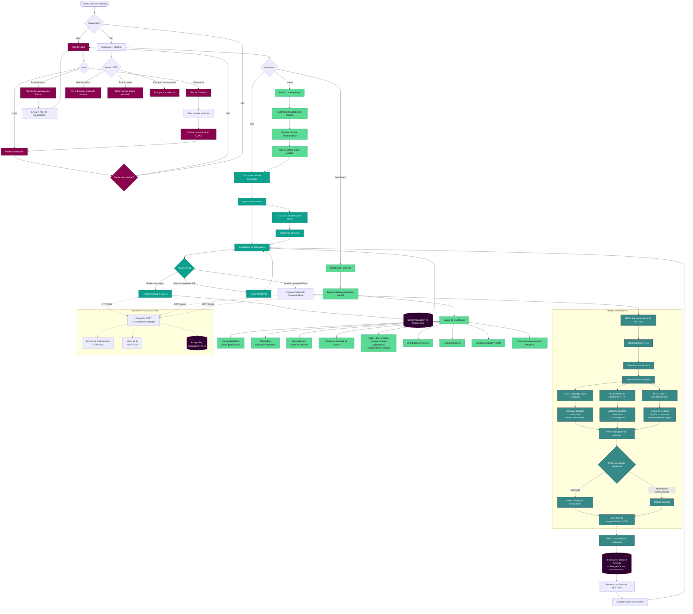

# Fluxograma Completo do Sistema

Visao geral de todos os fluxos do sistema de Compatibilidade Conversacional com IA.

```mermaid
flowchart TD
    %% ===== ENTRADA DO USUARIO =====
    Start([Usuario acessa o sistema]) --> AuthCheck{Autenticado?}

    %% ===== AUTENTICACAO =====
    AuthCheck -->|Nao| LoginPage[Tela de Login]
    LoginPage --> LoginAction{Acao}
    LoginAction -->|Login| ValidateCreds[Validar credenciais]
    LoginAction -->|Criar conta| SignupPage[Tela de Cadastro]
    LoginAction -->|Esqueci senha| ForgetPwd[Tela de Recuperacao de Senha]

    SignupPage --> CreateUser[Criar usuario no banco]
    CreateUser --> ConsentLGPD[Coletar consentimento LGPD]
    ConsentLGPD --> ValidateCreds

    ForgetPwd --> SendResetEmail[Enviar e-mail de recuperacao]
    SendResetEmail --> LoginPage

    ValidateCreds --> AuthResult{Credenciais validas?}
    AuthResult -->|Nao| LoginPage
    AuthResult -->|Sim| AuthCheck

    %% ===== LAYOUT PRINCIPAL =====
    AuthCheck -->|Sim| AppLayout[AppLayout + Sidebar]

    AppLayout --> NavChoice{Navegacao}
    NavChoice -->|Home| HomePage[Home - Landing Page]
    NavChoice -->|Chat| ChatPage[Chat - Interface de Conversas]
    NavChoice -->|Dashboard| DashboardPage[Dashboard - Metricas]

    %% ===== HOME =====
    HomePage --> HomeFeatures[Exibir funcionalidades do sistema]
    HomeFeatures --> HomeDemo[Preview de chat demonstrativo]
    HomeDemo --> HomeCTA[Call-to-Action: Iniciar Analise]
    HomeCTA --> ChatPage

    %% ===== CHAT =====
    ChatPage --> ChatLayout[Layout duas colunas]
    ChatLayout --> ConvList[Lista de Conversas com busca]
    ChatLayout --> ChatView[Visualizador de Mensagens]

    ConvList --> SelectConv[Selecionar conversa]
    SelectConv --> ChatView

    ChatView --> MsgInput{Acao no Chat}
    MsgInput -->|Enviar mensagem| SendMsg[Enviar mensagem via API]
    MsgInput -->|Alternar remetente A/B| ToggleSender[Trocar remetente]
    MsgInput -->|Analisar compatibilidade| TriggerAnalysis[Disparar Analise de Compatibilidade]

    SendMsg --> StoreMsg[(Salvar mensagem no PostgreSQL)]
    StoreMsg --> ChatView
    ToggleSender --> ChatView

    %% ===== PIPELINE DE ANALISE IA =====
    TriggerAnalysis --> PreProcess[RF02: Pre-processamento de Texto]

    subgraph pipeline ["Pipeline de Analise IA"]
        direction TB
        PreProcess --> Normalize[Normalizacao PT-BR]
        Normalize --> Tokenize[Tokenizacao e limpeza]
        Tokenize --> AnalysisPhase[Fase de Analise Paralela]

        AnalysisPhase --> LSM[RF03: Language Style Matching]
        AnalysisPhase --> Sentiment[RF04: Analise de Sentimento PT-BR]
        AnalysisPhase --> Behavioral[RF05: Sinais Comportamentais]

        LSM --> LSMDetail[Comparar palavras funcionais\nentre participantes]
        Sentiment --> SentDetail[Calcular polaridade emocional\ne convergencia]
        Behavioral --> BehDetail[Tempo de resposta\nEquilibrio de turnos\nTamanho de mensagens]

        LSMDetail --> Aggregation[RF06: Agregacao de Metricas]
        SentDetail --> Aggregation
        BehDetail --> Aggregation

        Aggregation --> HeuristicOrML{RF08: Metodo de agregacao}
        HeuristicOrML -->|Heuristica| WeightedAvg[Media ponderada configuravel]
        HeuristicOrML -->|Aprendizado supervisionado| MLModel[Modelo treinado]

        WeightedAvg --> FinalScore[Score final de compatibilidade 0-100]
        MLModel --> FinalScore
    end

    FinalScore --> Explainability[RF07: Gerar resumo explicativo]
    Explainability --> StorResults[(RF09: Salvar scores e metricas\nno PostgreSQL com versionamento)]
    StorResults --> ReturnAPI[Retornar resultado via REST API]
    ReturnAPI --> UpdateChat[Atualizar score na conversa]
    UpdateChat --> ChatView

    %% ===== DASHBOARD =====
    DashboardPage --> FetchMetrics[Buscar metricas agregadas via API]
    FetchMetrics --> DashLayout[Layout do Dashboard]

    DashLayout --> ScoreRing[CompatibilityRing\nScore geral circular]
    DashLayout --> MetricsBar[MetricsBar\nBarras por dimensao]
    DashLayout --> NetworkGraph[NetworkGraph\nGrafo de relacoes]
    DashLayout --> WeeklyTrend[Tendencia semanal de scores]
    DashLayout --> RadarChart[Radar: LSM, Emocao, Comportamento\nEngajamento, Reciprocidade, Fluencia]
    DashLayout --> Histogram[Distribuicao de scores]
    DashLayout --> TopPairs[Ranking de pares]
    DashLayout --> RecentActivity[Feed de atividade recente]
    DashLayout --> EmotionLine[Convergencia emocional temporal]

    %% ===== LGPD =====
    AppLayout --> LGPDActions{Acoes LGPD}
    LGPDActions -->|Solicitar dados| ExportData[RF12: Exportar dados do usuario]
    LGPDActions -->|Excluir dados| DeleteData[RF12: Excluir dados pessoais]
    LGPDActions -->|Revogar consentimento| RevokeConsent[Revogar e anonimizar]

    %% ===== BACKEND / API =====
    subgraph backend ["Backend - Flask REST API"]
        direction LR
        APIEndpoints[Endpoints REST\nRF01: Receber dialogos]
        AuthService[Servico de Autenticacao\nHTTPS/TLS]
        AIEngine[Motor de IA\nNLP PT-BR]
        DBLayer[(PostgreSQL\nSQLAlchemy ORM)]
    end

    SendMsg -.->|HTTP/Axios| APIEndpoints
    TriggerAnalysis -.->|HTTP/Axios| APIEndpoints
    FetchMetrics -.->|HTTP/Axios| APIEndpoints
    APIEndpoints -.-> AuthService
    APIEndpoints -.-> AIEngine
    APIEndpoints -.-> DBLayer

    %% ===== ESTILOS =====
    classDef auth fill:#8a034d,stroke:#2e0331,color:#fff
    classDef home fill:#5adb94,stroke:#0ba18c,color:#2e0331
    classDef chat fill:#0ba18c,stroke:#368986,color:#fff
    classDef ai fill:#368986,stroke:#2e0331,color:#fff
    classDef dash fill:#5adb94,stroke:#368986,color:#2e0331
    classDef db fill:#2e0331,stroke:#8a034d,color:#fff
    classDef lgpd fill:#8a034d,stroke:#2e0331,color:#fff

    class LoginPage,SignupPage,ForgetPwd,ValidateCreds,AuthResult,ConsentLGPD auth
    class HomePage,HomeFeatures,HomeDemo,HomeCTA home
    class ChatPage,ChatLayout,ConvList,ChatView,SelectConv,MsgInput,SendMsg,ToggleSender chat
    class PreProcess,Normalize,Tokenize,AnalysisPhase,LSM,Sentiment,Behavioral,LSMDetail,SentDetail,BehDetail,Aggregation,HeuristicOrML,WeightedAvg,MLModel,FinalScore,Explainability ai
    class DashboardPage,FetchMetrics,DashLayout,ScoreRing,MetricsBar,NetworkGraph,WeeklyTrend,RadarChart,Histogram,TopPairs,RecentActivity,EmotionLine dash
    class StoreMsg,StorResults,DBLayer db
    class ExportData,DeleteData,RevokeConsent lgpd
```
