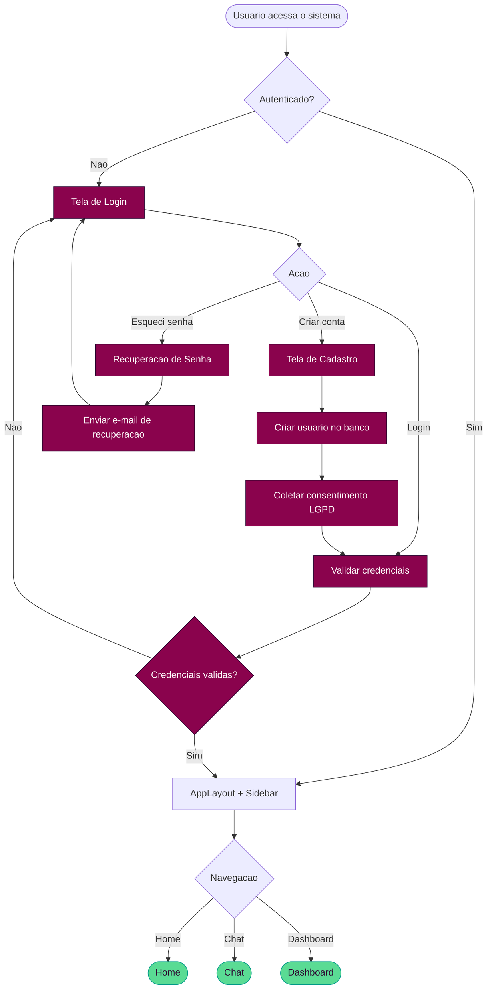

# Fluxo de Autenticacao

Fluxo de login, cadastro com consentimento LGPD, recuperacao de senha e navegacao principal.

```mermaid
flowchart TD
    Start([Usuario acessa o sistema]) --> AuthCheck{Autenticado?}

    AuthCheck -->|Nao| LoginPage[Tela de Login]
    AuthCheck -->|Sim| AppLayout[AppLayout + Sidebar]

    LoginPage --> LoginAction{Acao}
    LoginAction -->|Login| ValidateCreds[Validar credenciais]
    LoginAction -->|Criar conta| SignupPage[Tela de Cadastro]
    LoginAction -->|Esqueci senha| ForgetPwd[Recuperacao de Senha]

    SignupPage --> CreateUser[Criar usuario no banco]
    CreateUser --> ConsentLGPD[Coletar consentimento LGPD]
    ConsentLGPD --> ValidateCreds

    ForgetPwd --> SendResetEmail[Enviar e-mail de recuperacao]
    SendResetEmail --> LoginPage

    ValidateCreds --> AuthResult{Credenciais validas?}
    AuthResult -->|Nao| LoginPage
    AuthResult -->|Sim| AppLayout

    AppLayout --> NavChoice{Navegacao}
    NavChoice -->|Home| HomePage([Home])
    NavChoice -->|Chat| ChatPage([Chat])
    NavChoice -->|Dashboard| DashboardPage([Dashboard])

    classDef auth fill:#8a034d,stroke:#2e0331,color:#fff
    classDef nav fill:#5adb94,stroke:#0ba18c,color:#2e0331
    class LoginPage,SignupPage,ForgetPwd,ValidateCreds,AuthResult,ConsentLGPD,CreateUser,SendResetEmail auth
    class HomePage,ChatPage,DashboardPage nav
```
