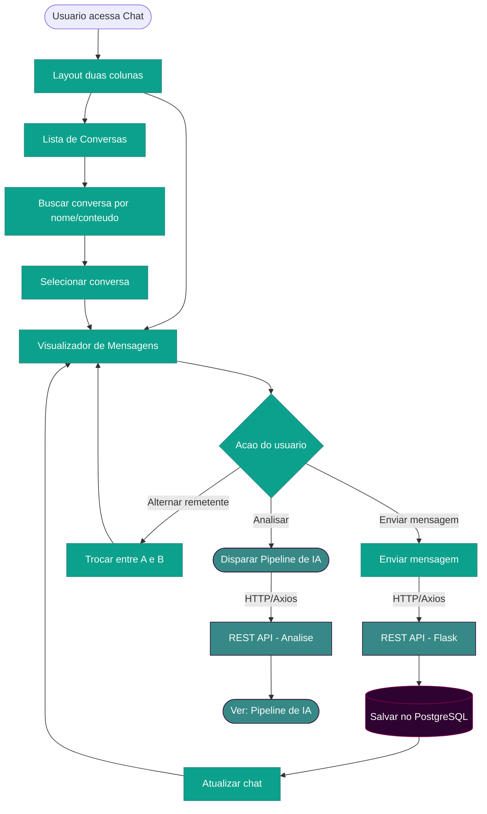

# Fluxo do Chat

Interface de conversas com lista, envio de mensagens, alternancia de remetente A/B e disparo de analise.

```mermaid
flowchart TD
    ChatPage([Usuario acessa Chat]) --> ChatLayout[Layout duas colunas]

    ChatLayout --> ConvList[Lista de Conversas]
    ChatLayout --> ChatView[Visualizador de Mensagens]

    ConvList --> Search[Buscar conversa por nome/conteudo]
    Search --> SelectConv[Selecionar conversa]
    SelectConv --> ChatView

    ChatView --> Action{Acao do usuario}

    Action -->|Enviar mensagem| SendMsg[Enviar mensagem]
    Action -->|Alternar remetente| ToggleSender[Trocar entre A e B]
    Action -->|Analisar| TriggerAnalysis([Disparar Pipeline de IA])

    SendMsg -->|HTTP/Axios| API[REST API - Flask]
    API --> StoreMsg[(Salvar no PostgreSQL)]
    StoreMsg --> RefreshChat[Atualizar chat]
    RefreshChat --> ChatView

    ToggleSender --> ChatView

    TriggerAnalysis -->|HTTP/Axios| APIAnalysis[REST API - Analise]
    APIAnalysis --> Pipeline([Ver: Pipeline de IA])

    classDef chat fill:#0ba18c,stroke:#368986,color:#fff
    classDef db fill:#2e0331,stroke:#8a034d,color:#fff
    classDef link fill:#368986,stroke:#2e0331,color:#fff
    class ChatLayout,ConvList,ChatView,Search,SelectConv,Action,SendMsg,ToggleSender,RefreshChat chat
    class StoreMsg db
    class TriggerAnalysis,Pipeline,API,APIAnalysis link
```
