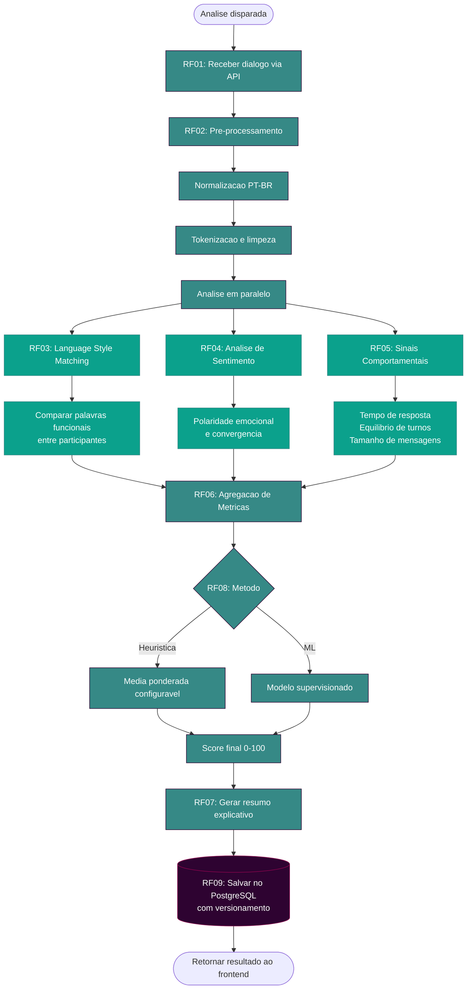

# Pipeline de Analise IA

Pre-processamento PT-BR, analise paralela das 3 dimensoes (LSM, Sentimento, Comportamental), agregacao e score final.

```mermaid
flowchart TD
    Trigger([Analise disparada]) --> Receive[RF01: Receber dialogo via API]
    Receive --> PreProcess[RF02: Pre-processamento]

    PreProcess --> Normalize[Normalizacao PT-BR]
    Normalize --> Tokenize[Tokenizacao e limpeza]

    Tokenize --> Parallel[Analise em paralelo]

    Parallel --> LSM[RF03: Language Style Matching]
    Parallel --> Sentiment[RF04: Analise de Sentimento]
    Parallel --> Behavioral[RF05: Sinais Comportamentais]

    LSM --> LSMOut[Comparar palavras funcionais\nentre participantes]
    Sentiment --> SentOut[Polaridade emocional\ne convergencia]
    Behavioral --> BehOut[Tempo de resposta\nEquilibrio de turnos\nTamanho de mensagens]

    LSMOut --> Aggregation[RF06: Agregacao de Metricas]
    SentOut --> Aggregation
    BehOut --> Aggregation

    Aggregation --> Method{RF08: Metodo}
    Method -->|Heuristica| Weighted[Media ponderada configuravel]
    Method -->|ML| MLModel[Modelo supervisionado]

    Weighted --> Score[Score final 0-100]
    MLModel --> Score

    Score --> Explain[RF07: Gerar resumo explicativo]
    Explain --> Store[(RF09: Salvar no PostgreSQL\ncom versionamento)]
    Store --> Return([Retornar resultado ao frontend])

    classDef ai fill:#368986,stroke:#2e0331,color:#fff
    classDef db fill:#2e0331,stroke:#8a034d,color:#fff
    classDef dim fill:#0ba18c,stroke:#368986,color:#fff
    class PreProcess,Normalize,Tokenize,Parallel,Aggregation,Method,Weighted,MLModel,Score,Explain,Receive ai
    class LSM,Sentiment,Behavioral,LSMOut,SentOut,BehOut dim
    class Store db
```
