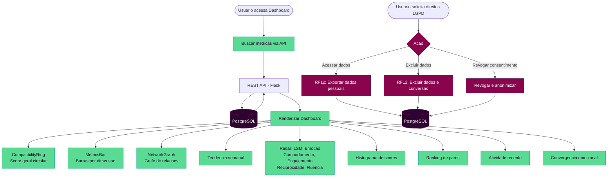

# Dashboard e Conformidade LGPD

Visualizacao dos 9 componentes de metricas e fluxos de direitos LGPD (acesso, exclusao, revogacao).

```mermaid
flowchart TD
    DashPage([Usuario acessa Dashboard]) --> Fetch[Buscar metricas via API]
    Fetch --> API[REST API - Flask]
    API --> DB[(PostgreSQL)]
    DB --> API
    API --> Layout[Renderizar Dashboard]

    Layout --> G1[CompatibilityRing\nScore geral circular]
    Layout --> G2[MetricsBar\nBarras por dimensao]
    Layout --> G3[NetworkGraph\nGrafo de relacoes]
    Layout --> G4[Tendencia semanal]
    Layout --> G5[Radar: LSM, Emocao\nComportamento, Engajamento\nReciprocidade, Fluencia]
    Layout --> G6[Histograma de scores]
    Layout --> G7[Ranking de pares]
    Layout --> G8[Atividade recente]
    Layout --> G9[Convergencia emocional]

    %% LGPD
    User([Usuario solicita direitos LGPD]) --> LGPDAction{Acao}
    LGPDAction -->|Acessar dados| Export[RF12: Exportar dados pessoais]
    LGPDAction -->|Excluir dados| Delete[RF12: Excluir dados e conversas]
    LGPDAction -->|Revogar consentimento| Revoke[Revogar e anonimizar]

    Export --> APIDB[(PostgreSQL)]
    Delete --> APIDB
    Revoke --> APIDB

    classDef dash fill:#5adb94,stroke:#0ba18c,color:#2e0331
    classDef db fill:#2e0331,stroke:#8a034d,color:#fff
    classDef lgpd fill:#8a034d,stroke:#2e0331,color:#fff
    class Layout,G1,G2,G3,G4,G5,G6,G7,G8,G9,Fetch dash
    class DB,APIDB db
    class Export,Delete,Revoke,LGPDAction lgpd
```
